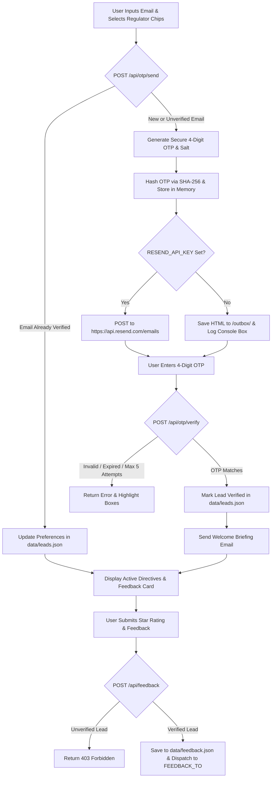

# ⚡ GRIP by Truvad — Zero-Dependency Regulatory Alert Widget & Engine

[](https://nodejs.org)
[](#-why-zero-dependencies)
[](LICENSE)
[](#-automated--manual-testing)

**GRIP by Truvad** is a lightweight, high-performance, **zero-dependency** enterprise regulatory intelligence platform and alert widget built with plain Node.js (v18+) and vanilla web standards (HTML5/CSS3/ES Modules). It features cryptographically secure 4-digit OTP authentication, real-time regulatory directive filtering (RBI, SEBI, SEC), atomic file persistence, inline HTML sanitization, and dual-mode transaction mailing (Resend API + offline Mock Outbox).

---

## 📌 Table of Contents

- [✨ Feature Highlights](#-feature-highlights)
- [📊 System Architecture & Flow Diagram](#-system-architecture--flow-diagram)
- [💡 Why Zero Dependencies?](#-why-zero-dependencies)
- [⚡ 3-Command Quick Start](#-3-command-quick-start)
- [📬 Mock Mode vs. Real Resend Email Setup](#-mock-mode-vs-real-resend-email-setup)
- [⚙️ Environment Variables](#%EF%B8%8F-environment-variables)
- [🔌 API Reference](#-api-reference)
- [🗄️ Data Schemas](#%EF%B8%8F-data-schemas)
- [🔒 Security & Hardening Measures](#-security--hardening-measures)
- [📂 Project Structure](#-project-structure)
- [🔀 Swapping JSON Storage for SQLite or PostgreSQL](#-swapping-json-storage-for-sqlite-or-postgresql)
- [🚀 Deployment Notes](#-deployment-notes)
- [🖼️ UI Screenshots](#%EF%B8%8F-ui-screenshots)

---

## ✨ Feature Highlights

- **Zero npm Dependencies**: Built strictly using Node.js built-in modules (`http`, `fs`, `path`, `crypto`, `url`). Runs out of the box without `npm install`.
- **Cryptographic 4-Digit OTP**: 16-byte random salting, SHA-256 hashing, and constant-time `crypto.timingSafeEqual` comparison to eliminate timing attacks. Plain codes are never stored in memory.
- **Multi-Step Interactive Banner**: Accessible UI featuring live email format checking, selectable regulator chips (RBI, SEBI, SEC), 4-box OTP input with auto-advance, backspace navigation, paste support, 5-minute expiry countdown, and 30-second resend cooldown.
- **Already-Verified Lead Shortcut**: Detects previously verified emails, updates regulator preferences, and bypasses Step 2 OTP verification straight to the active directives feed.
- **Verified-Only Feedback Gate**: Rejects unverified email feedback with `403 Forbidden` to prevent spam.
- **Atomic File Database**: Write-to-temp-and-rename pattern (`tmp -> renameSync`) prevents JSON file corruption during server interrupts.
- **Dual Mailer Engine**: Sends real emails via Resend HTTP API or logs formatted ASCII outbox boxes to the terminal while saving `.html` / `.json` files to `/outbox/`.

---

## 📊 System Architecture & Flow Diagram



---

## 💡 Why Zero Dependencies?

Modern web projects often suffer from supply-chain vulnerabilities, heavy `node_modules` bloated dependencies, and breaking updates. GRIP is engineered to demonstrate that Node.js v18+ native APIs provide all necessary primitives:

| Requirement | Conventional NPM Package | GRIP Native Implementation |
| :--- | :--- | :--- |
| **HTTP Server** | `express`, `fastify` | `http.createServer()` |
| **Env Loader** | `dotenv` | Native line-by-line `.env` parser in `src/config.js` |
| **Crypto & OTP** | `bcrypt`, `speakeasy` | `crypto.randomInt()`, `crypto.createHash('sha256')`, `crypto.timingSafeEqual()` |
| **Mailing** | `nodemailer`, `@resend/node` | Native global `fetch()` with Bearer Auth |
| **Test Runner** | `jest`, `mocha` | Built-in `node --test` & `node:assert/strict` |

---

## ⚡ 3-Command Quick Start

No `npm install` required! Simply clone, navigate, and run:

```bash
# 1. Clone repository
git clone https://github.com/your-org/grip-alert-widget.git

# 2. Change directory
cd grip-alert-widget

# 3. Start server
node server.js
```

Open your browser at **`http://localhost:3000`**.

To run the automated test suite:
```bash
npm test
```

---

## 📬 Mock Mode vs. Real Resend Email Setup

### 1. Offline Mock Mode (Default — Zero Setup)
When `RESEND_API_KEY` is omitted from `.env`:
- No external network requests are made for email.
- Emails are written as static `.html` and `.json` files inside the auto-created `/outbox/` directory.
- An ASCII box containing recipient, subject, and the OTP code is printed directly to the server terminal.
- A yellow **Mock Mode Active** banner appears in the web UI.

### 2. Live Production Mode (Resend API)
To dispatch real emails to inboxes:
1. Obtain an API Key from [resend.com](https://resend.com).
2. Create or edit `.env` in the root directory:
   ```env
   PORT=3000
   RESEND_API_KEY=re_123456789_your_resend_key
   MAIL_FROM=GRIP Alerts <onboarding@resend.dev>
   FEEDBACK_TO=griptruvad@gmail.com
   OTP_TTL_SECONDS=300
   ```
3. Restart the server (`node server.js`). The server will automatically switch to **Resend API Active** mode.

---

## ⚙️ Environment Variables

| Variable | Default Value | Description |
| :--- | :--- | :--- |
| `PORT` | `3000` | HTTP server listening port |
| `RESEND_API_KEY` | *Empty* | Resend API key. If empty, enables offline Mock Outbox Mode. |
| `MAIL_FROM` | `Grip Alerts <alerts@example.com>` | Sender email header address |
| `FEEDBACK_TO` | `griptruvad@gmail.com` | Destination email for user feedback alerts |
| `OTP_TTL_SECONDS` | `300` | Verification code expiration time in seconds (5 minutes) |

---

## 🔌 API Reference

### `GET /api/health`
Returns system status, active mailer mode, and timestamp.
```json
{
  "status": "ok",
  "name": "grip-alert-widget",
  "version": "1.0.0",
  "mailerMode": "outbox-mock",
  "feedbackTo": "griptruvad@gmail.com",
  "timestamp": "2026-10-01T18:30:00.000Z"
}
```

---

### `POST /api/otp/send`
Validates email, checks rate limits, and sends a 4-digit OTP.

**Request Body**:
```json
{
  "email": "officer@bank.com",
  "preferences": { "rbi": true, "sebi": true, "sec": false }
}
```

**Response (New Lead)**:
```json
{
  "success": true,
  "message": "OTP sent successfully to officer@bank.com.",
  "ttlSeconds": 300,
  "mode": "outbox",
  "mockOtpCode": "4824"
}
```

**Response (Already Verified Lead Shortcut)**:
```json
{
  "success": true,
  "alreadyVerified": true,
  "message": "Welcome back! Your email is already verified. Preferences updated.",
  "lead": { ... }
}
```

---

### `POST /api/otp/verify`
Verifies 4-digit OTP code, persists verified lead to `data/leads.json`, and sends welcome email.

**Request Body**:
```json
{
  "email": "officer@bank.com",
  "otp": "4824",
  "preferences": { "rbi": true, "sebi": true, "sec": false }
}
```

**Response**:
```json
{
  "success": true,
  "verified": true,
  "message": "OTP verified and lead registered successfully.",
  "lead": {
    "id": "lead_1790878553198_nyup0",
    "email": "officer@bank.com",
    "verified": true,
    "preferences": { "rbi": true, "sebi": true, "sec": false },
    "createdAt": "2026-10-01T18:15:53.198Z",
    "verifiedAt": "2026-10-01T18:15:53.198Z"
  }
}
```

---

### `POST /api/feedback`
Submits user rating and feedback. **Requires the email to belong to a verified lead**.

**Request Body**:
```json
{
  "email": "officer@bank.com",
  "rating": 5,
  "message": "Outstanding zero-dependency performance and clean UI!"
}
```

**Response (Success — 200 OK)**:
```json
{
  "success": true,
  "message": "Feedback submitted successfully.",
  "feedback": {
    "id": "fb_1790878553206_b3xwb",
    "email": "officer@bank.com",
    "rating": 5,
    "message": "Outstanding zero-dependency performance and clean UI!",
    "createdAt": "2026-10-01T18:15:53.206Z"
  }
}
```

**Response (Unverified Email — 403 Forbidden)**:
```json
{
  "success": false,
  "error": "Only verified leads can submit feedback. Please verify your email first."
}
```

---

### `GET /api/updates`
Returns regulatory updates. Supports optional filtering: `/api/updates?regulators=rbi,sebi`.

---

## 🗄️ Data Schemas

### Lead Schema (`data/leads.json`)
```json
{
  "id": "lead_1790878553198_nyup0",
  "email": "officer@bank.com",
  "verified": true,
  "preferences": {
    "rbi": true,
    "sebi": true,
    "sec": false
  },
  "createdAt": "2026-10-01T18:15:53.198Z",
  "verifiedAt": "2026-10-01T18:15:53.198Z"
}
```

### Feedback Schema (`data/feedback.json`)
```json
{
  "id": "fb_1790878553206_b3xwb",
  "email": "officer@bank.com",
  "rating": 5,
  "category": "General",
  "message": "Verified lead feedback test success!",
  "createdAt": "2026-10-01T18:15:53.206Z"
}
```

---

## 🔒 Security & Hardening Measures

1. **Hashed OTP Storage**: Plain codes are never stored in memory. Stored records contain `{ hash, salt, expiresAt, attempts }`.
2. **Timing-Safe Comparison**: `crypto.timingSafeEqual()` eliminates side-channel timing attacks during hash comparisons.
3. **Brute-Force Guard**: Automatically deletes OTP records after 5 consecutive failed attempts.
4. **Body-Size Ceiling (10KB)**: Drops payloads > 10KB immediately to protect against memory exhaustion attacks.
5. **Per-IP Rate Limiter**: Sliding window limits requests to 60 req/min per client IP address.
6. **HTML Entity Escaping (`escapeHtml`)**: Prevents HTML/script injection in email templates.
7. **Directory Traversal Protection**: Prevents arbitrary file retrieval outside the `/public/` directory.

---

## 📂 Project Structure

```
grip-alert-widget/
├── server.js               # Primary HTTP Server & Router
├── package.json            # Scripts: start, test
├── .env.example            # Config template
├── .gitignore              # Ignored paths
├── TESTING.md              # Automated test suite & manual checklist
├── src/
│   ├── config.js           # .env file loader
│   ├── storage.js          # Atomic JSON database
│   ├── updates.js          # Mock regulatory directives loader & filter
│   ├── otp.js              # Cryptographic OTP module
│   ├── mailer.js           # Resend API + Mock Outbox mailer
│   └── validators.js       # Input validation routines
├── test/
│   ├── api.test.js         # Integration tests for HTTP API
│   ├── otp.test.js         # Unit tests for OTP module
│   ├── storage.test.js     # Storage engine unit tests
│   └── validators.test.js  # Validator unit tests
├── public/
│   ├── index.html          # Widget markup & accessibility attributes
│   ├── styles.css          # Styling system & dark/light mode
│   └── app.js              # Client-side 4-box OTP & step engine
├── data/
│   ├── mock-updates.json   # Regulatory directives (RBI, SEBI, SEC)
│   ├── leads.json          # Persisted verified leads
│   └── feedback.json       # Persisted feedback records
└── outbox/                 # Mock outbox static .html and .json files
```

---

## 🔀 Swapping JSON Storage for SQLite or PostgreSQL

The application interacts with data exclusively through functional abstractions in `src/storage.js`. To replace JSON file persistence:

### Swapping for SQLite (`better-sqlite3` or `node:sqlite`)
Replace the JSON file helpers in `src/storage.js`:
```javascript
import Database from 'better-sqlite3';
const db = new Database('data/app.db');

db.exec(`CREATE TABLE IF NOT EXISTS leads (
  id TEXT PRIMARY KEY,
  email TEXT UNIQUE,
  verified INTEGER,
  preferences TEXT,
  created_at TEXT,
  verified_at TEXT
);`);

export function getLead(email) {
  const row = db.prepare('SELECT * FROM leads WHERE email = ?').get(email.toLowerCase().trim());
  if (!row) return null;
  return { ...row, verified: Boolean(row.verified), preferences: JSON.parse(row.preferences) };
}
```

### Swapping for PostgreSQL (`pg`)
```javascript
import { Pool } from 'pg';
const pool = new Pool({ connectionString: process.env.DATABASE_URL });

export async function upsertLead({ email, preferences, verified, verifiedAt }) {
  const query = `
    INSERT INTO leads (id, email, verified, preferences, created_at, verified_at)
    VALUES ($1, $2, $3, $4, $5, $6)
    ON CONFLICT (email) DO UPDATE SET
      verified = EXCLUDED.verified,
      preferences = EXCLUDED.preferences,
      verified_at = EXCLUDED.verified_at
    RETURNING *;
  `;
  const { rows } = await pool.query(query, [...]);
  return rows[0];
}
```

---

## 🚀 Deployment Guide

### 🌐 Option 1: Render (Long-Running Node Server — Recommended)

Render provides persistent long-running instances with full local disk write support.

1. **Create Web Service**: Connect your GitHub repository to [render.com](https://render.com).
2. **Environment & Commands**:
   - **Environment**: `Node`
   - **Build Command**: *(leave blank or `npm test`)*
   - **Start Command**: `node server.js` or `npm start`
3. **Environment Variables**: Add `RESEND_API_KEY`, `MAIL_FROM`, `FEEDBACK_TO`, `PORT` (Render defaults to `10000`).

---

### 🚂 Option 2: Railway (Persistent Node Server — Recommended)

Railway automatically detects the `package.json` start script (`node server.js`).

1. **Deploy Repository**: Create a new project on [railway.app](https://railway.app) and select your GitHub repo.
2. **Settings**:
   - **Start Command**: `node server.js`
3. **Variables**: Configure environment variables (`RESEND_API_KEY`, `FEEDBACK_TO`).

---

### ⚡ Option 3: Vercel (Serverless Functions)

Vercel deploys serverless functions via [`api/index.js`](file:///c:/Users/0sank/OneDrive/Desktop/truv/api/index.js) and [`vercel.json`](file:///c:/Users/0sank/OneDrive/Desktop/truv/vercel.json).

#### ⚠️ Ephemeral Storage Trade-Off & In-Memory Fallback
- **Vercel Functions are Stateless & Read-Only**: Serverless lambda instances scale dynamically and run on ephemeral filesystems. Local JSON writes to `/data/leads.json` or `/outbox/` do not persist across lambda invocations or separate instances.
- **Built-in Fallback**: GRIP includes an automatic in-memory fallback in `src/storage.js` so serverless functions run smoothly without crashing.
- **Production Serverless Recommendation**: For permanent lead storage on serverless platforms, configure a remote database like **PostgreSQL** or **Supabase** (see [Swapping JSON Storage](#-swapping-json-storage-for-sqlite-or-postgresql)).

#### Deploying to Vercel:
```bash
# Deploy via Vercel CLI
npm i -g vercel
vercel
```
Or import the repository directly into your [Vercel Dashboard](https://vercel.com). The included [`vercel.json`](file:///c:/Users/0sank/OneDrive/Desktop/truv/vercel.json) routes API requests to `api/index.js` and static frontend requests to `/public`.

---

## 🖼️ UI Screenshots

```
+-----------------------------------------------------------------------+
|  GRIP by Truvad — Enterprise Regulatory Intelligence                  |
|  [System Active] [Mock Outbox Mode]                                   |
+-----------------------------------------------------------------------+
|  Get Personalized Regulatory Updates                                  |
|  Work Email: [ officer@bank.com                 ]                     |
|  Preferences: [✓] RBI Updates  [✓] SEBI Updates  [ ] SEC Updates      |
|  [ Send Verification OTP → ]                                          |
+-----------------------------------------------------------------------+
|  Security Verification                                                |
|  [ 1 ] [ 2 ] [ 3 ] [ 4 ]                                              |
|  Expires in: 04:59                      [ Resend OTP (28s) ]          |
|  [ Back ]                             [ Verify & Activate ]           |
+-----------------------------------------------------------------------+
```

---

## 📄 License

Distributed under the MIT License. See `LICENSE` for details.
